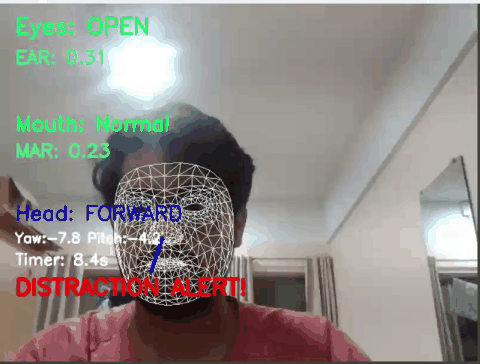

# 🚗 Driver Monitoring System

A real-time computer vision based Driver Monitoring System that analyzes facial landmarks to monitor driver alertness and distraction.

The system uses **MediaPipe Face Mesh** and **OpenCV** to detect eye closure, yawning, head orientation, and prolonged distraction through a webcam.

## 🎥 Demo


---

## 📌 Project Overview

Driver fatigue and distraction are important factors in road safety.

This project implements a lightweight, real-time Driver Monitoring System using facial landmark analysis. Instead of training a large deep-learning model, the system uses facial landmarks and geometric measurements to monitor driver behavior.

The application can:

- Detect whether the driver's eyes are open or closed
- Calculate Eye Aspect Ratio (EAR)
- Detect yawning using Mouth Aspect Ratio (MAR)
- Estimate head orientation using head pose estimation
- Detect prolonged left/right/downward distraction
- Trigger a Windows audio warning when distraction persists

---

## ✨ Features

### 👁️ Eye Blink Detection

The system calculates the **Eye Aspect Ratio (EAR)** using facial landmarks.

```text
Eyes OPEN   → Normal
Eyes CLOSED → Possible drowsiness

🥱 Yawn Detection

The system detects yawning by calculating the Mouth Aspect Ratio (MAR) from facial landmarks.

Mouth Normal  → Normal
Mouth Open    → Yawning

A yawn alert is triggered when the mouth remains open for a sustained number of frames.

How MAR Works

The system compares the vertical mouth opening with the horizontal mouth width.

A larger MAR value indicates a more open mouth and can be used as an indicator of yawning.

The system estimates the orientation of the driver's head using facial landmarks and OpenCV's solvePnP() method.

It identifies five head positions:

FORWARD
LEFT
RIGHT
UP
DOWN

The system calculates:

Yaw → left/right head rotation
Pitch → up/down head movement

A calibration stage is used to establish the driver's neutral head position before distraction monitoring begins.


⚠️ Driver Distraction Detection

The system monitors the driver's head orientation continuously to identify prolonged periods of distraction.

If the driver looks away from the forward direction for approximately 2 seconds, the system generates a visual warning.

LEFT / RIGHT  →  DISTRACTION ALERT!
DOWN           →  PHONE DISTRACTION!

A timer tracks how long the driver remains in a distracted position. The timer decreases when the driver returns to an attentive, forward-facing position.


🔊 Continuous Audio Alert

When a distraction alert is triggered, the system activates a continuous Windows audio warning to notify the driver.

The alarm:

No distraction  →  No sound
Distraction     →  Alarm starts
Driver attentive →  Alarm stops

The alarm is designed to continue while the distraction condition remains active and stop when the driver returns to an attentive position.


## 🧠 How It Works

```text
Webcam Input
      ↓
OpenCV Frame Capture
      ↓
MediaPipe Face Mesh
      ↓
Facial Landmarks
      ↓
 ┌──────────────┬──────────────┬
 │              │              │
EAR Analysis    MAR Analysis   Head Pose
 │              │              │
 ↓              ↓              ↓
Eye State       Mouth State    Head Direction
 │              │              │
 └───────┬──────┘              │
         ↓                      ↓
   Drowsiness Analysis    Distraction Analysis
         │                      │
         └──────────┬───────────┘
                    ↓
             Driver Alert System
                    ↓
        ┌───────────┴───────────┐
        ↓                       ↓
   Visual Warning          Audio Alarm


This now shows the complete flow:

**Webcam → Face landmarks → EAR/MAR/Head Pose → Drowsiness/Distraction analysis → Visual + Audio alerts.**

That is a much better representation of what your actual project does.

🛠️ Technologies Used
Python — Core programming language
OpenCV — Webcam capture, image processing, and visualization
MediaPipe Face Mesh — Real-time facial landmark detection
NumPy — Mathematical calculations for EAR, MAR, and head-pose processing
OpenCV solvePnP() — Head pose estimation
Windows winsound — Audio warning system

The system is designed to run in real time using a standard laptop webcam without requiring a dedicated GPU.


📐 Detection Methods
Eye Aspect Ratio (EAR)

The system uses Eye Aspect Ratio (EAR) to determine whether the driver's eyes are open or closed.

$$ EAR = \frac{||P_2-P_6|| + ||P_3-P_5||} {2||P_1-P_4||} $$

When the eyes close, the vertical distance between the eyelid landmarks decreases, causing the EAR value to decrease.

Mouth Aspect Ratio (MAR)

The system uses Mouth Aspect Ratio (MAR) to measure the degree of mouth opening.

The implementation compares the vertical mouth opening with the horizontal mouth width.

A higher MAR value indicates a wider mouth opening and is used as an indicator of yawning.

Head Pose Estimation

Head orientation is estimated using selected facial landmarks and OpenCV's solvePnP() method.

The system calculates:

Yaw → left/right head rotation
Pitch → up/down head movement

A short calibration stage establishes the driver's neutral head position before distraction monitoring begins.

Project Structure

Driver-Monitoring-System/
│
├── assets/
│   └── demo.gif
│
├── modules/
│   ├── head_pose.py
│   └── yawn_detector.py
│
├── screenshots/
│   ├── straight.png
│   └── other direction.png
│
├── videos/
│
├── driver_monitor.py
├── requirements.txt
├── .gitignore
└── README.md

## 💻 Installation

### 1. Clone the repository

```bash
git clone https://github.com/neelabhishek20/Driver-Monitoring-System.git


## 💻 Installation

### 1. Clone the repository

```bash
git clone https://github.com/neelabhishek20/Driver-Monitoring-System.git

Open the project directory
cd Driver-Monitoring-System

Install dependencies
pip install -r requirements.txt

▶️ Running the Project

Run the main application:

python driver_monitor.py

The webcam will open automatically and the Driver Monitoring System will begin processing the live video feed.

Controls

Press:

ESC

to exit the application.

🖥️ Example Output
Normal Monitoring

Driver Distraction Alert


## 🔬 Current Implementation

The current version is a lightweight real-time prototype based on facial landmark analysis.

It uses:

- Facial landmark geometry
- Eye Aspect Ratio (EAR)
- Mouth Aspect Ratio (MAR)
- Head pose estimation using `solvePnP()`
- Neutral-position calibration
- Time-based distraction detection
- Windows audio alerts

No custom neural network training is required for the current implementation.

---

## 📊 Testing

The system was tested using a laptop webcam under different conditions, including:

- Looking straight at the camera
- Normal blinking
- Keeping the eyes closed
- Opening the mouth to simulate yawning
- Turning the head left
- Turning the head right
- Looking downward
- Maintaining a distracted head position

The current implementation is intended as an **academic and portfolio prototype**, not as a production-certified automotive safety system.

---

## 🚀 Future Improvements

- Dataset-based evaluation
- Improved head-pose smoothing
- Better low-light performance
- Driver-specific calibration
- Phone/object detection using YOLO
- Seatbelt detection
- FPS and performance monitoring
- Event logging and analytics
- Advanced dashboard interface
- Improved robustness across different drivers

---

## 🎓 Project Applications

The project can be explored for:

- Automotive driver monitoring
- Driver fatigue monitoring
- Driver distraction analysis
- ADAS research
- Computer vision applications
- Human-machine interaction

---

## 👨‍💻 Author

**Neel Abhishek**

Third-Year Engineering Student

**Interests:** Computer Vision | AI | Robotics | Data Engineering

---

## ⭐ Acknowledgements

This project uses open-source technologies including:

- [OpenCV](https://opencv.org/)
- [MediaPipe](https://ai.google.dev/edge/mediapipe/solutions/guide)
- [NumPy](https://numpy.org/)

---

## 📜 License

This project is intended for educational and portfolio purposes.  